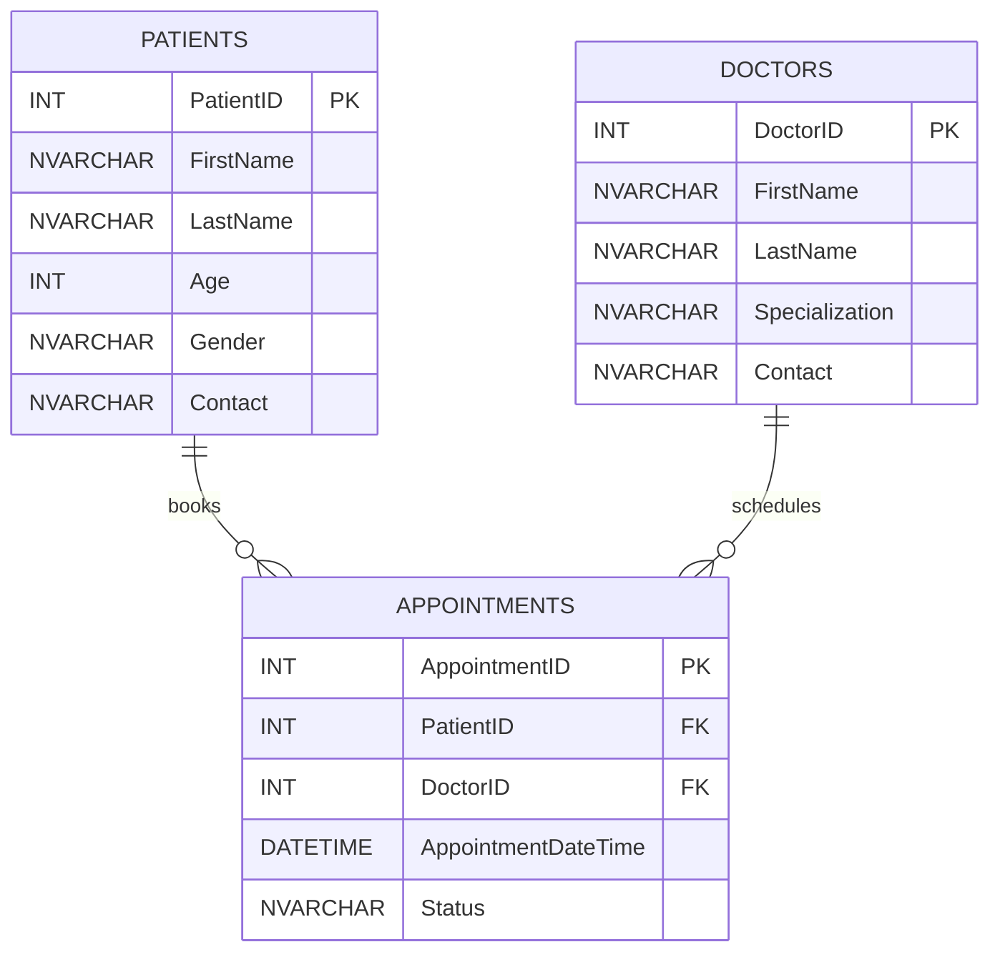

```mermaid
erDiagram
  PATIENTS ||--o{ APPOINTMENTS : books
  DOCTORS  ||--o{ APPOINTMENTS : schedules

  PATIENTS {
    INT PatientID PK
    NVARCHAR FirstName
    NVARCHAR LastName
    INT Age
    NVARCHAR Gender
    NVARCHAR Contact
  }

  DOCTORS {
    INT DoctorID PK
    NVARCHAR FirstName
    NVARCHAR LastName
    NVARCHAR Specialization
    NVARCHAR Contact
  }

  APPOINTMENTS {
    INT AppointmentID PK
    INT PatientID FK
    INT DoctorID FK
    DATETIME AppointmentDateTime
    NVARCHAR Status
  }
```

## ️ER Diagram (Mermaid)

## ️ER Diagram (Mermaid)

## ️ER Diagram (Mermaid)

## ️ER Diagram (Mermaid)

## ️ER Diagram (Mermaid)

## ️ER Diagram (Mermaid)

## ️ER Diagram (Mermaid)

## ️ER Diagram (Mermaid)

## ️ER Diagram (Mermaid)

## ️ER Diagram (Mermaid)

## ️ER Diagram (Mermaid)

## ️ER Diagram (Mermaid)

## ️ER Diagram (Mermaid)

## ️ER Diagram (Mermaid)

## ️ER Diagram (Mermaid)

## ️ER Diagram (Mermaid)

## ️ER Diagram (Mermaid)

## ️ER Diagram (Mermaid)

## ️ER Diagram (Mermaid)

## ️ER Diagram (Mermaid)

## ️ER Diagram (Mermaid)
```mermaid
erDiagram
  PATIENTS ||--o{ APPOINTMENTS : books
  DOCTORS  ||--o{ APPOINTMENTS : schedules

  PATIENTS {
    INT PatientID PK
    NVARCHAR FirstName
    NVARCHAR LastName
    INT Age
    NVARCHAR Gender
    NVARCHAR Contact
  }

  DOCTORS {
    INT DoctorID PK
    NVARCHAR FirstName
    NVARCHAR LastName
    NVARCHAR Specialization
    NVARCHAR Contact
  }

  APPOINTMENTS {
    INT AppointmentID PK
    INT PatientID FK
    INT DoctorID FK
    DATETIME AppointmentDateTime
    NVARCHAR Status
  }
```
## ️ER Diagram (Mermaid)
```mermaid
erDiagram
  PATIENTS ||--o{ APPOINTMENTS : books
  DOCTORS  ||--o{ APPOINTMENTS : schedules

  PATIENTS {
    INT PatientID PK
    NVARCHAR FirstName
    NVARCHAR LastName
    INT Age
    NVARCHAR Gender
    NVARCHAR Contact
  }

  DOCTORS {
    INT DoctorID PK
    NVARCHAR FirstName
    NVARCHAR LastName
    NVARCHAR Specialization
    NVARCHAR Contact
  }

  APPOINTMENTS {
    INT AppointmentID PK
    INT PatientID FK
    INT DoctorID FK
    DATETIME AppointmentDateTime
    NVARCHAR Status
  }
```
## ️ER Diagram (Mermaid)
```mermaid
erDiagram
  PATIENTS ||--o{ APPOINTMENTS : books
  DOCTORS  ||--o{ APPOINTMENTS : schedules

  PATIENTS {
    INT PatientID PK
    NVARCHAR FirstName
    NVARCHAR LastName
    INT Age
    NVARCHAR Gender
    NVARCHAR Contact
  }

  DOCTORS {
    INT DoctorID PK
    NVARCHAR FirstName
    NVARCHAR LastName
    NVARCHAR Specialization
    NVARCHAR Contact
  }

  APPOINTMENTS {
    INT AppointmentID PK
    INT PatientID FK
    INT DoctorID FK
    DATETIME AppointmentDateTime
    NVARCHAR Status
  }
```
## ️ER Diagram (Mermaid)
```mermaid
erDiagram
  PATIENTS ||--o{ APPOINTMENTS : books
  DOCTORS  ||--o{ APPOINTMENTS : schedules

  PATIENTS {
    INT PatientID PK
    NVARCHAR FirstName
    NVARCHAR LastName
    INT Age
    NVARCHAR Gender
    NVARCHAR Contact
  }

  DOCTORS {
    INT DoctorID PK
    NVARCHAR FirstName
    NVARCHAR LastName
    NVARCHAR Specialization
    NVARCHAR Contact
  }

  APPOINTMENTS {
    INT AppointmentID PK
    INT PatientID FK
    INT DoctorID FK
    DATETIME AppointmentDateTime
    NVARCHAR Status
  }
```
## ️ER Diagram (Mermaid)
```mermaid
erDiagram
  PATIENTS ||--o{ APPOINTMENTS : books
  DOCTORS  ||--o{ APPOINTMENTS : schedules

  PATIENTS {
    INT PatientID PK
    NVARCHAR FirstName
    NVARCHAR LastName
    INT Age
    NVARCHAR Gender
    NVARCHAR Contact
  }

  DOCTORS {
    INT DoctorID PK
    NVARCHAR FirstName
    NVARCHAR LastName
    NVARCHAR Specialization
    NVARCHAR Contact
  }

  APPOINTMENTS {
    INT AppointmentID PK
    INT PatientID FK
    INT DoctorID FK
    DATETIME AppointmentDateTime
    NVARCHAR Status
  }
```
## ️ER Diagram (Mermaid)
```mermaid
erDiagram
  PATIENTS ||--o{ APPOINTMENTS : books
  DOCTORS  ||--o{ APPOINTMENTS : schedules

  PATIENTS {
    INT PatientID PK
    NVARCHAR FirstName
    NVARCHAR LastName
    INT Age
    NVARCHAR Gender
    NVARCHAR Contact
  }

  DOCTORS {
    INT DoctorID PK
    NVARCHAR FirstName
    NVARCHAR LastName
    NVARCHAR Specialization
    NVARCHAR Contact
  }

  APPOINTMENTS {
    INT AppointmentID PK
    INT PatientID FK
    INT DoctorID FK
    DATETIME AppointmentDateTime
    NVARCHAR Status
  }
```
## ️ER Diagram (Mermaid)
```mermaid
erDiagram
  PATIENTS ||--o{ APPOINTMENTS : books
  DOCTORS  ||--o{ APPOINTMENTS : schedules

  PATIENTS {
    INT PatientID PK
    NVARCHAR FirstName
    NVARCHAR LastName
    INT Age
    NVARCHAR Gender
    NVARCHAR Contact
  }

  DOCTORS {
    INT DoctorID PK
    NVARCHAR FirstName
    NVARCHAR LastName
    NVARCHAR Specialization
    NVARCHAR Contact
  }

  APPOINTMENTS {
    INT AppointmentID PK
    INT PatientID FK
    INT DoctorID FK
    DATETIME AppointmentDateTime
    NVARCHAR Status
  }
```
## ️ER Diagram (Mermaid)
```mermaid
erDiagram
  PATIENTS ||--o{ APPOINTMENTS : books
  DOCTORS  ||--o{ APPOINTMENTS : schedules

  PATIENTS {
    INT PatientID PK
    NVARCHAR FirstName
    NVARCHAR LastName
    INT Age
    NVARCHAR Gender
    NVARCHAR Contact
  }

  DOCTORS {
    INT DoctorID PK
    NVARCHAR FirstName
    NVARCHAR LastName
    NVARCHAR Specialization
    NVARCHAR Contact
  }

  APPOINTMENTS {
    INT AppointmentID PK
    INT PatientID FK
    INT DoctorID FK
    DATETIME AppointmentDateTime
    NVARCHAR Status
  }
```
## ️ER Diagram (Mermaid)
```mermaid
erDiagram
  PATIENTS ||--o{ APPOINTMENTS : books
  DOCTORS  ||--o{ APPOINTMENTS : schedules

  PATIENTS {
    INT PatientID PK
    NVARCHAR FirstName
    NVARCHAR LastName
    INT Age
    NVARCHAR Gender
    NVARCHAR Contact
  }

  DOCTORS {
    INT DoctorID PK
    NVARCHAR FirstName
    NVARCHAR LastName
    NVARCHAR Specialization
    NVARCHAR Contact
  }

  APPOINTMENTS {
    INT AppointmentID PK
    INT PatientID FK
    INT DoctorID FK
    DATETIME AppointmentDateTime
    NVARCHAR Status
  }
```
## ️ER Diagram (Mermaid)
```mermaid
erDiagram
  PATIENTS ||--o{ APPOINTMENTS : books
  DOCTORS  ||--o{ APPOINTMENTS : schedules

  PATIENTS {
    INT PatientID PK
    NVARCHAR FirstName
    NVARCHAR LastName
    INT Age
    NVARCHAR Gender
    NVARCHAR Contact
  }

  DOCTORS {
    INT DoctorID PK
    NVARCHAR FirstName
    NVARCHAR LastName
    NVARCHAR Specialization
    NVARCHAR Contact
  }

  APPOINTMENTS {
    INT AppointmentID PK
    INT PatientID FK
    INT DoctorID FK
    DATETIME AppointmentDateTime
    NVARCHAR Status
  }
```
## ️ER Diagram (Mermaid)
```mermaid
erDiagram
  PATIENTS ||--o{ APPOINTMENTS : books
  DOCTORS  ||--o{ APPOINTMENTS : schedules

  PATIENTS {
    INT PatientID PK
    NVARCHAR FirstName
    NVARCHAR LastName
    INT Age
    NVARCHAR Gender
    NVARCHAR Contact
  }

  DOCTORS {
    INT DoctorID PK
    NVARCHAR FirstName
    NVARCHAR LastName
    NVARCHAR Specialization
    NVARCHAR Contact
  }

  APPOINTMENTS {
    INT AppointmentID PK
    INT PatientID FK
    INT DoctorID FK
    DATETIME AppointmentDateTime
    NVARCHAR Status
  }
```
## ️ER Diagram (Mermaid)
```mermaid
erDiagram
  PATIENTS ||--o{ APPOINTMENTS : books
  DOCTORS  ||--o{ APPOINTMENTS : schedules

  PATIENTS {
    INT PatientID PK
    NVARCHAR FirstName
    NVARCHAR LastName
    INT Age
    NVARCHAR Gender
    NVARCHAR Contact
  }

  DOCTORS {
    INT DoctorID PK
    NVARCHAR FirstName
    NVARCHAR LastName
    NVARCHAR Specialization
    NVARCHAR Contact
  }

  APPOINTMENTS {
    INT AppointmentID PK
    INT PatientID FK
    INT DoctorID FK
    DATETIME AppointmentDateTime
    NVARCHAR Status
  }
```
## ️ER Diagram (Mermaid)
```mermaid
erDiagram
  PATIENTS ||--o{ APPOINTMENTS : books
  DOCTORS  ||--o{ APPOINTMENTS : schedules

  PATIENTS {
    INT PatientID PK
    NVARCHAR FirstName
    NVARCHAR LastName
    INT Age
    NVARCHAR Gender
    NVARCHAR Contact
  }

  DOCTORS {
    INT DoctorID PK
    NVARCHAR FirstName
    NVARCHAR LastName
    NVARCHAR Specialization
    NVARCHAR Contact
  }

  APPOINTMENTS {
    INT AppointmentID PK
    INT PatientID FK
    INT DoctorID FK
    DATETIME AppointmentDateTime
    NVARCHAR Status
  }
```
## ️ER Diagram (Mermaid)
```mermaid
erDiagram
  PATIENTS ||--o{ APPOINTMENTS : books
  DOCTORS  ||--o{ APPOINTMENTS : schedules

  PATIENTS {
    INT PatientID PK
    NVARCHAR FirstName
    NVARCHAR LastName
    INT Age
    NVARCHAR Gender
    NVARCHAR Contact
  }

  DOCTORS {
    INT DoctorID PK
    NVARCHAR FirstName
    NVARCHAR LastName
    NVARCHAR Specialization
    NVARCHAR Contact
  }

  APPOINTMENTS {
    INT AppointmentID PK
    INT PatientID FK
    INT DoctorID FK
    DATETIME AppointmentDateTime
    NVARCHAR Status
  }
```
## ️ER Diagram (Mermaid)
```mermaid
erDiagram
  PATIENTS ||--o{ APPOINTMENTS : books
  DOCTORS  ||--o{ APPOINTMENTS : schedules

  PATIENTS {
    INT PatientID PK
    NVARCHAR FirstName
    NVARCHAR LastName
    INT Age
    NVARCHAR Gender
    NVARCHAR Contact
  }

  DOCTORS {
    INT DoctorID PK
    NVARCHAR FirstName
    NVARCHAR LastName
    NVARCHAR Specialization
    NVARCHAR Contact
  }

  APPOINTMENTS {
    INT AppointmentID PK
    INT PatientID FK
    INT DoctorID FK
    DATETIME AppointmentDateTime
    NVARCHAR Status
  }
```
## ️ER Diagram (Mermaid)
```mermaid
erDiagram
  PATIENTS ||--o{ APPOINTMENTS : books
  DOCTORS  ||--o{ APPOINTMENTS : schedules

  PATIENTS {
    INT PatientID PK
    NVARCHAR FirstName
    NVARCHAR LastName
    INT Age
    NVARCHAR Gender
    NVARCHAR Contact
  }

  DOCTORS {
    INT DoctorID PK
    NVARCHAR FirstName
    NVARCHAR LastName
    NVARCHAR Specialization
    NVARCHAR Contact
  }

  APPOINTMENTS {
    INT AppointmentID PK
    INT PatientID FK
    INT DoctorID FK
    DATETIME AppointmentDateTime
    NVARCHAR Status
  }
```
## ️ER Diagram (Mermaid)
```mermaid
erDiagram
  PATIENTS ||--o{ APPOINTMENTS : books
  DOCTORS  ||--o{ APPOINTMENTS : schedules

  PATIENTS {
    INT PatientID PK
    NVARCHAR FirstName
    NVARCHAR LastName
    INT Age
    NVARCHAR Gender
    NVARCHAR Contact
  }

  DOCTORS {
    INT DoctorID PK
    NVARCHAR FirstName
    NVARCHAR LastName
    NVARCHAR Specialization
    NVARCHAR Contact
  }

  APPOINTMENTS {
    INT AppointmentID PK
    INT PatientID FK
    INT DoctorID FK
    DATETIME AppointmentDateTime
    NVARCHAR Status
  }
```
## ️ER Diagram (Mermaid)
```mermaid
erDiagram
  PATIENTS ||--o{ APPOINTMENTS : books
  DOCTORS  ||--o{ APPOINTMENTS : schedules

  PATIENTS {
    INT PatientID PK
    NVARCHAR FirstName
    NVARCHAR LastName
    INT Age
    NVARCHAR Gender
    NVARCHAR Contact
  }

  DOCTORS {
    INT DoctorID PK
    NVARCHAR FirstName
    NVARCHAR LastName
    NVARCHAR Specialization
    NVARCHAR Contact
  }

  APPOINTMENTS {
    INT AppointmentID PK
    INT PatientID FK
    INT DoctorID FK
    DATETIME AppointmentDateTime
    NVARCHAR Status
  }
```
## ️ER Diagram (Mermaid)
```mermaid
erDiagram
  PATIENTS ||--o{ APPOINTMENTS : books
  DOCTORS  ||--o{ APPOINTMENTS : schedules

  PATIENTS {
    INT PatientID PK
    NVARCHAR FirstName
    NVARCHAR LastName
    INT Age
    NVARCHAR Gender
    NVARCHAR Contact
  }

  DOCTORS {
    INT DoctorID PK
    NVARCHAR FirstName
    NVARCHAR LastName
    NVARCHAR Specialization
    NVARCHAR Contact
  }

  APPOINTMENTS {
    INT AppointmentID PK
    INT PatientID FK
    INT DoctorID FK
    DATETIME AppointmentDateTime
    NVARCHAR Status
  }
```
## ️ER Diagram (Mermaid)
```mermaid
erDiagram
  PATIENTS ||--o{ APPOINTMENTS : books
  DOCTORS  ||--o{ APPOINTMENTS : schedules

  PATIENTS {
    INT PatientID PK
    NVARCHAR FirstName
    NVARCHAR LastName
    INT Age
    NVARCHAR Gender
    NVARCHAR Contact
  }

  DOCTORS {
    INT DoctorID PK
    NVARCHAR FirstName
    NVARCHAR LastName
    NVARCHAR Specialization
    NVARCHAR Contact
  }

  APPOINTMENTS {
    INT AppointmentID PK
    INT PatientID FK
    INT DoctorID FK
    DATETIME AppointmentDateTime
    NVARCHAR Status
  }
```
## ️ER Diagram (Mermaid)
```mermaid
erDiagram
  PATIENTS ||--o{ APPOINTMENTS : books
  DOCTORS  ||--o{ APPOINTMENTS : schedules

  PATIENTS {
    INT PatientID PK
    NVARCHAR FirstName
    NVARCHAR LastName
    INT Age
    NVARCHAR Gender
    NVARCHAR Contact
  }

  DOCTORS {
    INT DoctorID PK
    NVARCHAR FirstName
    NVARCHAR LastName
    NVARCHAR Specialization
    NVARCHAR Contact
  }

  APPOINTMENTS {
    INT AppointmentID PK
    INT PatientID FK
    INT DoctorID FK
    DATETIME AppointmentDateTime
    NVARCHAR Status
  }
```
## ️ER Diagram (Mermaid)
```mermaid
erDiagram
  PATIENTS ||--o{ APPOINTMENTS : books
  DOCTORS  ||--o{ APPOINTMENTS : schedules

  PATIENTS {
    INT PatientID PK
    NVARCHAR FirstName
    NVARCHAR LastName
    INT Age
    NVARCHAR Gender
    NVARCHAR Contact
  }

  DOCTORS {
    INT DoctorID PK
    NVARCHAR FirstName
    NVARCHAR LastName
    NVARCHAR Specialization
    NVARCHAR Contact
  }

  APPOINTMENTS {
    INT AppointmentID PK
    INT PatientID FK
    INT DoctorID FK
    DATETIME AppointmentDateTime
    NVARCHAR Status
  }
```
## ️ER Diagram (Mermaid)
```mermaid
erDiagram
  PATIENTS ||--o{ APPOINTMENTS : books
  DOCTORS  ||--o{ APPOINTMENTS : schedules

  PATIENTS {
    INT PatientID PK
    NVARCHAR FirstName
    NVARCHAR LastName
    INT Age
    NVARCHAR Gender
    NVARCHAR Contact
  }

  DOCTORS {
    INT DoctorID PK
    NVARCHAR FirstName
    NVARCHAR LastName
    NVARCHAR Specialization
    NVARCHAR Contact
  }

  APPOINTMENTS {
    INT AppointmentID PK
    INT PatientID FK
    INT DoctorID FK
    DATETIME AppointmentDateTime
    NVARCHAR Status
  }
```
## ️ER Diagram (Mermaid)
```mermaid
erDiagram
  PATIENTS ||--o{ APPOINTMENTS : books
  DOCTORS  ||--o{ APPOINTMENTS : schedules

  PATIENTS {
    INT PatientID PK
    NVARCHAR FirstName
    NVARCHAR LastName
    INT Age
    NVARCHAR Gender
    NVARCHAR Contact
  }

  DOCTORS {
    INT DoctorID PK
    NVARCHAR FirstName
    NVARCHAR LastName
    NVARCHAR Specialization
    NVARCHAR Contact
  }

  APPOINTMENTS {
    INT AppointmentID PK
    INT PatientID FK
    INT DoctorID FK
    DATETIME AppointmentDateTime
    NVARCHAR Status
  }
```
## ️ER Diagram (Mermaid)
```mermaid
erDiagram
  PATIENTS ||--o{ APPOINTMENTS : books
  DOCTORS  ||--o{ APPOINTMENTS : schedules

  PATIENTS {
    INT PatientID PK
    NVARCHAR FirstName
    NVARCHAR LastName
    INT Age
    NVARCHAR Gender
    NVARCHAR Contact
  }

  DOCTORS {
    INT DoctorID PK
    NVARCHAR FirstName
    NVARCHAR LastName
    NVARCHAR Specialization
    NVARCHAR Contact
  }

  APPOINTMENTS {
    INT AppointmentID PK
    INT PatientID FK
    INT DoctorID FK
    DATETIME AppointmentDateTime
    NVARCHAR Status
  }
```
## ️ER Diagram (Mermaid)
```mermaid
erDiagram
  PATIENTS ||--o{ APPOINTMENTS : books
  DOCTORS  ||--o{ APPOINTMENTS : schedules

  PATIENTS {
    INT PatientID PK
    NVARCHAR FirstName
    NVARCHAR LastName
    INT Age
    NVARCHAR Gender
    NVARCHAR Contact
  }

  DOCTORS {
    INT DoctorID PK
    NVARCHAR FirstName
    NVARCHAR LastName
    NVARCHAR Specialization
    NVARCHAR Contact
  }

  APPOINTMENTS {
    INT AppointmentID PK
    INT PatientID FK
    INT DoctorID FK
    DATETIME AppointmentDateTime
    NVARCHAR Status
  }
```
## ️ER Diagram (Mermaid)
```mermaid
erDiagram
  PATIENTS ||--o{ APPOINTMENTS : books
  DOCTORS  ||--o{ APPOINTMENTS : schedules

  PATIENTS {
    INT PatientID PK
    NVARCHAR FirstName
    NVARCHAR LastName
    INT Age
    NVARCHAR Gender
    NVARCHAR Contact
  }

  DOCTORS {
    INT DoctorID PK
    NVARCHAR FirstName
    NVARCHAR LastName
    NVARCHAR Specialization
    NVARCHAR Contact
  }

  APPOINTMENTS {
    INT AppointmentID PK
    INT PatientID FK
    INT DoctorID FK
    DATETIME AppointmentDateTime
    NVARCHAR Status
  }
```
## ️ER Diagram (Mermaid)
```mermaid
erDiagram
  PATIENTS ||--o{ APPOINTMENTS : books
  DOCTORS  ||--o{ APPOINTMENTS : schedules

  PATIENTS {
    INT PatientID PK
    NVARCHAR FirstName
    NVARCHAR LastName
    INT Age
    NVARCHAR Gender
    NVARCHAR Contact
  }

  DOCTORS {
    INT DoctorID PK
    NVARCHAR FirstName
    NVARCHAR LastName
    NVARCHAR Specialization
    NVARCHAR Contact
  }

  APPOINTMENTS {
    INT AppointmentID PK
    INT PatientID FK
    INT DoctorID FK
    DATETIME AppointmentDateTime
    NVARCHAR Status
  }
```
## ️ER Diagram (Mermaid)
```mermaid
erDiagram
  PATIENTS ||--o{ APPOINTMENTS : books
  DOCTORS  ||--o{ APPOINTMENTS : schedules

  PATIENTS {
    INT PatientID PK
    NVARCHAR FirstName
    NVARCHAR LastName
    INT Age
    NVARCHAR Gender
    NVARCHAR Contact
  }

  DOCTORS {
    INT DoctorID PK
    NVARCHAR FirstName
    NVARCHAR LastName
    NVARCHAR Specialization
    NVARCHAR Contact
  }

  APPOINTMENTS {
    INT AppointmentID PK
    INT PatientID FK
    INT DoctorID FK
    DATETIME AppointmentDateTime
    NVARCHAR Status
  }
```
## ️ER Diagram (Mermaid)
```mermaid
erDiagram
  PATIENTS ||--o{ APPOINTMENTS : books
  DOCTORS  ||--o{ APPOINTMENTS : schedules

  PATIENTS {
    INT PatientID PK
    NVARCHAR FirstName
    NVARCHAR LastName
    INT Age
    NVARCHAR Gender
    NVARCHAR Contact
  }

  DOCTORS {
    INT DoctorID PK
    NVARCHAR FirstName
    NVARCHAR LastName
    NVARCHAR Specialization
    NVARCHAR Contact
  }

  APPOINTMENTS {
    INT AppointmentID PK
    INT PatientID FK
    INT DoctorID FK
    DATETIME AppointmentDateTime
    NVARCHAR Status
  }
```
## ️ER Diagram (Mermaid)
```mermaid
erDiagram
  PATIENTS ||--o{ APPOINTMENTS : books
  DOCTORS  ||--o{ APPOINTMENTS : schedules

  PATIENTS {
    INT PatientID PK
    NVARCHAR FirstName
    NVARCHAR LastName
    INT Age
    NVARCHAR Gender
    NVARCHAR Contact
  }

  DOCTORS {
    INT DoctorID PK
    NVARCHAR FirstName
    NVARCHAR LastName
    NVARCHAR Specialization
    NVARCHAR Contact
  }

  APPOINTMENTS {
    INT AppointmentID PK
    INT PatientID FK
    INT DoctorID FK
    DATETIME AppointmentDateTime
    NVARCHAR Status
  }
```
## ️ER Diagram (Mermaid)
```mermaid
erDiagram
  PATIENTS ||--o{ APPOINTMENTS : books
  DOCTORS  ||--o{ APPOINTMENTS : schedules

  PATIENTS {
    INT PatientID PK
    NVARCHAR FirstName
    NVARCHAR LastName
    INT Age
    NVARCHAR Gender
    NVARCHAR Contact
  }

  DOCTORS {
    INT DoctorID PK
    NVARCHAR FirstName
    NVARCHAR LastName
    NVARCHAR Specialization
    NVARCHAR Contact
  }

  APPOINTMENTS {
    INT AppointmentID PK
    INT PatientID FK
    INT DoctorID FK
    DATETIME AppointmentDateTime
    NVARCHAR Status
  }
```
## ️ER Diagram (Mermaid)
```mermaid
erDiagram
  PATIENTS ||--o{ APPOINTMENTS : books
  DOCTORS  ||--o{ APPOINTMENTS : schedules

  PATIENTS {
    INT PatientID PK
    NVARCHAR FirstName
    NVARCHAR LastName
    INT Age
    NVARCHAR Gender
    NVARCHAR Contact
  }

  DOCTORS {
    INT DoctorID PK
    NVARCHAR FirstName
    NVARCHAR LastName
    NVARCHAR Specialization
    NVARCHAR Contact
  }

  APPOINTMENTS {
    INT AppointmentID PK
    INT PatientID FK
    INT DoctorID FK
    DATETIME AppointmentDateTime
    NVARCHAR Status
  }
```
## ️ER Diagram (Mermaid)
```mermaid
erDiagram
  PATIENTS ||--o{ APPOINTMENTS : books
  DOCTORS  ||--o{ APPOINTMENTS : schedules

  PATIENTS {
    INT PatientID PK
    NVARCHAR FirstName
    NVARCHAR LastName
    INT Age
    NVARCHAR Gender
    NVARCHAR Contact
  }

  DOCTORS {
    INT DoctorID PK
    NVARCHAR FirstName
    NVARCHAR LastName
    NVARCHAR Specialization
    NVARCHAR Contact
  }

  APPOINTMENTS {
    INT AppointmentID PK
    INT PatientID FK
    INT DoctorID FK
    DATETIME AppointmentDateTime
    NVARCHAR Status
  }
```
## ️ER Diagram (Mermaid)
```mermaid
erDiagram
  PATIENTS ||--o{ APPOINTMENTS : books
  DOCTORS  ||--o{ APPOINTMENTS : schedules

  PATIENTS {
    INT PatientID PK
    NVARCHAR FirstName
    NVARCHAR LastName
    INT Age
    NVARCHAR Gender
    NVARCHAR Contact
  }

  DOCTORS {
    INT DoctorID PK
    NVARCHAR FirstName
    NVARCHAR LastName
    NVARCHAR Specialization
    NVARCHAR Contact
  }

  APPOINTMENTS {
    INT AppointmentID PK
    INT PatientID FK
    INT DoctorID FK
    DATETIME AppointmentDateTime
    NVARCHAR Status
  }
```
## ️ER Diagram (Mermaid)
```mermaid
erDiagram
  PATIENTS ||--o{ APPOINTMENTS : books
  DOCTORS  ||--o{ APPOINTMENTS : schedules

  PATIENTS {
    INT PatientID PK
    NVARCHAR FirstName
    NVARCHAR LastName
    INT Age
    NVARCHAR Gender
    NVARCHAR Contact
  }

  DOCTORS {
    INT DoctorID PK
    NVARCHAR FirstName
    NVARCHAR LastName
    NVARCHAR Specialization
    NVARCHAR Contact
  }

  APPOINTMENTS {
    INT AppointmentID PK
    INT PatientID FK
    INT DoctorID FK
    DATETIME AppointmentDateTime
    NVARCHAR Status
  }
```
## ️ER Diagram (Mermaid)
```mermaid
erDiagram
  PATIENTS ||--o{ APPOINTMENTS : books
  DOCTORS  ||--o{ APPOINTMENTS : schedules

  PATIENTS {
    INT PatientID PK
    NVARCHAR FirstName
    NVARCHAR LastName
    INT Age
    NVARCHAR Gender
    NVARCHAR Contact
  }

  DOCTORS {
    INT DoctorID PK
    NVARCHAR FirstName
    NVARCHAR LastName
    NVARCHAR Specialization
    NVARCHAR Contact
  }

  APPOINTMENTS {
    INT AppointmentID PK
    INT PatientID FK
    INT DoctorID FK
    DATETIME AppointmentDateTime
    NVARCHAR Status
  }
```
## ️ER Diagram (Mermaid)
```mermaid
erDiagram
  PATIENTS ||--o{ APPOINTMENTS : books
  DOCTORS  ||--o{ APPOINTMENTS : schedules

  PATIENTS {
    INT PatientID PK
    NVARCHAR FirstName
    NVARCHAR LastName
    INT Age
    NVARCHAR Gender
    NVARCHAR Contact
  }

  DOCTORS {
    INT DoctorID PK
    NVARCHAR FirstName
    NVARCHAR LastName
    NVARCHAR Specialization
    NVARCHAR Contact
  }

  APPOINTMENTS {
    INT AppointmentID PK
    INT PatientID FK
    INT DoctorID FK
    DATETIME AppointmentDateTime
    NVARCHAR Status
  }
```
## ️ER Diagram (Mermaid)
```mermaid
erDiagram
  PATIENTS ||--o{ APPOINTMENTS : books
  DOCTORS  ||--o{ APPOINTMENTS : schedules

  PATIENTS {
    INT PatientID PK
    NVARCHAR FirstName
    NVARCHAR LastName
    INT Age
    NVARCHAR Gender
    NVARCHAR Contact
  }

  DOCTORS {
    INT DoctorID PK
    NVARCHAR FirstName
    NVARCHAR LastName
    NVARCHAR Specialization
    NVARCHAR Contact
  }

  APPOINTMENTS {
    INT AppointmentID PK
    INT PatientID FK
    INT DoctorID FK
    DATETIME AppointmentDateTime
    NVARCHAR Status
  }
```
## ️ER Diagram (Mermaid)
```mermaid
erDiagram
  PATIENTS ||--o{ APPOINTMENTS : books
  DOCTORS  ||--o{ APPOINTMENTS : schedules

  PATIENTS {
    INT PatientID PK
    NVARCHAR FirstName
    NVARCHAR LastName
    INT Age
    NVARCHAR Gender
    NVARCHAR Contact
  }

  DOCTORS {
    INT DoctorID PK
    NVARCHAR FirstName
    NVARCHAR LastName
    NVARCHAR Specialization
    NVARCHAR Contact
  }

  APPOINTMENTS {
    INT AppointmentID PK
    INT PatientID FK
    INT DoctorID FK
    DATETIME AppointmentDateTime
    NVARCHAR Status
  }
```
## ️ER Diagram (Mermaid)
```mermaid
erDiagram
  PATIENTS ||--o{ APPOINTMENTS : books
  DOCTORS  ||--o{ APPOINTMENTS : schedules

  PATIENTS {
    INT PatientID PK
    NVARCHAR FirstName
    NVARCHAR LastName
    INT Age
    NVARCHAR Gender
    NVARCHAR Contact
  }

  DOCTORS {
    INT DoctorID PK
    NVARCHAR FirstName
    NVARCHAR LastName
    NVARCHAR Specialization
    NVARCHAR Contact
  }

  APPOINTMENTS {
    INT AppointmentID PK
    INT PatientID FK
    INT DoctorID FK
    DATETIME AppointmentDateTime
    NVARCHAR Status
  }
```
## ️ER Diagram (Mermaid)
```mermaid
erDiagram
  PATIENTS ||--o{ APPOINTMENTS : books
  DOCTORS  ||--o{ APPOINTMENTS : schedules

  PATIENTS {
    INT PatientID PK
    NVARCHAR FirstName
    NVARCHAR LastName
    INT Age
    NVARCHAR Gender
    NVARCHAR Contact
  }

  DOCTORS {
    INT DoctorID PK
    NVARCHAR FirstName
    NVARCHAR LastName
    NVARCHAR Specialization
    NVARCHAR Contact
  }

  APPOINTMENTS {
    INT AppointmentID PK
    INT PatientID FK
    INT DoctorID FK
    DATETIME AppointmentDateTime
    NVARCHAR Status
  }
```
## ️ER Diagram (Mermaid)
```mermaid
erDiagram
  PATIENTS ||--o{ APPOINTMENTS : books
  DOCTORS  ||--o{ APPOINTMENTS : schedules

  PATIENTS {
    INT PatientID PK
    NVARCHAR FirstName
    NVARCHAR LastName
    INT Age
    NVARCHAR Gender
    NVARCHAR Contact
  }

  DOCTORS {
    INT DoctorID PK
    NVARCHAR FirstName
    NVARCHAR LastName
    NVARCHAR Specialization
    NVARCHAR Contact
  }

  APPOINTMENTS {
    INT AppointmentID PK
    INT PatientID FK
    INT DoctorID FK
    DATETIME AppointmentDateTime
    NVARCHAR Status
  }
```
## ️ER Diagram (Mermaid)
```mermaid
erDiagram
  PATIENTS ||--o{ APPOINTMENTS : books
  DOCTORS  ||--o{ APPOINTMENTS : schedules

  PATIENTS {
    INT PatientID PK
    NVARCHAR FirstName
    NVARCHAR LastName
    INT Age
    NVARCHAR Gender
    NVARCHAR Contact
  }

  DOCTORS {
    INT DoctorID PK
    NVARCHAR FirstName
    NVARCHAR LastName
    NVARCHAR Specialization
    NVARCHAR Contact
  }

  APPOINTMENTS {
    INT AppointmentID PK
    INT PatientID FK
    INT DoctorID FK
    DATETIME AppointmentDateTime
    NVARCHAR Status
  }
```
## ️ER Diagram (Mermaid)
```mermaid
erDiagram
  PATIENTS ||--o{ APPOINTMENTS : books
  DOCTORS  ||--o{ APPOINTMENTS : schedules

  PATIENTS {
    INT PatientID PK
    NVARCHAR FirstName
    NVARCHAR LastName
    INT Age
    NVARCHAR Gender
    NVARCHAR Contact
  }

  DOCTORS {
    INT DoctorID PK
    NVARCHAR FirstName
    NVARCHAR LastName
    NVARCHAR Specialization
    NVARCHAR Contact
  }

  APPOINTMENTS {
    INT AppointmentID PK
    INT PatientID FK
    INT DoctorID FK
    DATETIME AppointmentDateTime
    NVARCHAR Status
  }
```
## ️ER Diagram (Mermaid)
```mermaid
erDiagram
  PATIENTS ||--o{ APPOINTMENTS : books
  DOCTORS  ||--o{ APPOINTMENTS : schedules

  PATIENTS {
    INT PatientID PK
    NVARCHAR FirstName
    NVARCHAR LastName
    INT Age
    NVARCHAR Gender
    NVARCHAR Contact
  }

  DOCTORS {
    INT DoctorID PK
    NVARCHAR FirstName
    NVARCHAR LastName
    NVARCHAR Specialization
    NVARCHAR Contact
  }

  APPOINTMENTS {
    INT AppointmentID PK
    INT PatientID FK
    INT DoctorID FK
    DATETIME AppointmentDateTime
    NVARCHAR Status
  }
```
## ️ER Diagram (Mermaid)
```mermaid
erDiagram
  PATIENTS ||--o{ APPOINTMENTS : books
  DOCTORS  ||--o{ APPOINTMENTS : schedules

  PATIENTS {
    INT PatientID PK
    NVARCHAR FirstName
    NVARCHAR LastName
    INT Age
    NVARCHAR Gender
    NVARCHAR Contact
  }

  DOCTORS {
    INT DoctorID PK
    NVARCHAR FirstName
    NVARCHAR LastName
    NVARCHAR Specialization
    NVARCHAR Contact
  }

  APPOINTMENTS {
    INT AppointmentID PK
    INT PatientID FK
    INT DoctorID FK
    DATETIME AppointmentDateTime
    NVARCHAR Status
  }
```
## ️ER Diagram (Mermaid)
```mermaid
erDiagram
  PATIENTS ||--o{ APPOINTMENTS : books
  DOCTORS  ||--o{ APPOINTMENTS : schedules

  PATIENTS {
    INT PatientID PK
    NVARCHAR FirstName
    NVARCHAR LastName
    INT Age
    NVARCHAR Gender
    NVARCHAR Contact
  }

  DOCTORS {
    INT DoctorID PK
    NVARCHAR FirstName
    NVARCHAR LastName
    NVARCHAR Specialization
    NVARCHAR Contact
  }

  APPOINTMENTS {
    INT AppointmentID PK
    INT PatientID FK
    INT DoctorID FK
    DATETIME AppointmentDateTime
    NVARCHAR Status
  }
```
## ️ER Diagram (Mermaid)
```mermaid
erDiagram
  PATIENTS ||--o{ APPOINTMENTS : books
  DOCTORS  ||--o{ APPOINTMENTS : schedules

  PATIENTS {
    INT PatientID PK
    NVARCHAR FirstName
    NVARCHAR LastName
    INT Age
    NVARCHAR Gender
    NVARCHAR Contact
  }

  DOCTORS {
    INT DoctorID PK
    NVARCHAR FirstName
    NVARCHAR LastName
    NVARCHAR Specialization
    NVARCHAR Contact
  }

  APPOINTMENTS {
    INT AppointmentID PK
    INT PatientID FK
    INT DoctorID FK
    DATETIME AppointmentDateTime
    NVARCHAR Status
  }
```
## ️ER Diagram (Mermaid)
```mermaid
erDiagram
  PATIENTS ||--o{ APPOINTMENTS : books
  DOCTORS  ||--o{ APPOINTMENTS : schedules

  PATIENTS {
    INT PatientID PK
    NVARCHAR FirstName
    NVARCHAR LastName
    INT Age
    NVARCHAR Gender
    NVARCHAR Contact
  }

  DOCTORS {
    INT DoctorID PK
    NVARCHAR FirstName
    NVARCHAR LastName
    NVARCHAR Specialization
    NVARCHAR Contact
  }

  APPOINTMENTS {
    INT AppointmentID PK
    INT PatientID FK
    INT DoctorID FK
    DATETIME AppointmentDateTime
    NVARCHAR Status
  }
```
## ️ER Diagram (Mermaid)
```mermaid
erDiagram
  PATIENTS ||--o{ APPOINTMENTS : books
  DOCTORS  ||--o{ APPOINTMENTS : schedules

  PATIENTS {
    INT PatientID PK
    NVARCHAR FirstName
    NVARCHAR LastName
    INT Age
    NVARCHAR Gender
    NVARCHAR Contact
  }

  DOCTORS {
    INT DoctorID PK
    NVARCHAR FirstName
    NVARCHAR LastName
    NVARCHAR Specialization
    NVARCHAR Contact
  }

  APPOINTMENTS {
    INT AppointmentID PK
    INT PatientID FK
    INT DoctorID FK
    DATETIME AppointmentDateTime
    NVARCHAR Status
  }
```
## ️ER Diagram (Mermaid)
```mermaid
erDiagram
  PATIENTS ||--o{ APPOINTMENTS : books
  DOCTORS  ||--o{ APPOINTMENTS : schedules

  PATIENTS {
    INT PatientID PK
    NVARCHAR FirstName
    NVARCHAR LastName
    INT Age
    NVARCHAR Gender
    NVARCHAR Contact
  }

  DOCTORS {
    INT DoctorID PK
    NVARCHAR FirstName
    NVARCHAR LastName
    NVARCHAR Specialization
    NVARCHAR Contact
  }

  APPOINTMENTS {
    INT AppointmentID PK
    INT PatientID FK
    INT DoctorID FK
    DATETIME AppointmentDateTime
    NVARCHAR Status
  }
```
## ️ER Diagram (Mermaid)
```mermaid
erDiagram
  PATIENTS ||--o{ APPOINTMENTS : books
  DOCTORS  ||--o{ APPOINTMENTS : schedules

  PATIENTS {
    INT PatientID PK
    NVARCHAR FirstName
    NVARCHAR LastName
    INT Age
    NVARCHAR Gender
    NVARCHAR Contact
  }

  DOCTORS {
    INT DoctorID PK
    NVARCHAR FirstName
    NVARCHAR LastName
    NVARCHAR Specialization
    NVARCHAR Contact
  }

  APPOINTMENTS {
    INT AppointmentID PK
    INT PatientID FK
    INT DoctorID FK
    DATETIME AppointmentDateTime
    NVARCHAR Status
  }
```
## ️ER Diagram (Mermaid)
```mermaid
erDiagram
  PATIENTS ||--o{ APPOINTMENTS : books
  DOCTORS  ||--o{ APPOINTMENTS : schedules

  PATIENTS {
    INT PatientID PK
    NVARCHAR FirstName
    NVARCHAR LastName
    INT Age
    NVARCHAR Gender
    NVARCHAR Contact
  }

  DOCTORS {
    INT DoctorID PK
    NVARCHAR FirstName
    NVARCHAR LastName
    NVARCHAR Specialization
    NVARCHAR Contact
  }

  APPOINTMENTS {
    INT AppointmentID PK
    INT PatientID FK
    INT DoctorID FK
    DATETIME AppointmentDateTime
    NVARCHAR Status
  }
```
## ️ER Diagram (Mermaid)
```mermaid
erDiagram
  PATIENTS ||--o{ APPOINTMENTS : books
  DOCTORS  ||--o{ APPOINTMENTS : schedules

  PATIENTS {
    INT PatientID PK
    NVARCHAR FirstName
    NVARCHAR LastName
    INT Age
    NVARCHAR Gender
    NVARCHAR Contact
  }

  DOCTORS {
    INT DoctorID PK
    NVARCHAR FirstName
    NVARCHAR LastName
    NVARCHAR Specialization
    NVARCHAR Contact
  }

  APPOINTMENTS {
    INT AppointmentID PK
    INT PatientID FK
    INT DoctorID FK
    DATETIME AppointmentDateTime
    NVARCHAR Status
  }
```
## ️ER Diagram (Mermaid)
```mermaid
erDiagram
  PATIENTS ||--o{ APPOINTMENTS : books
  DOCTORS  ||--o{ APPOINTMENTS : schedules

  PATIENTS {
    INT PatientID PK
    NVARCHAR FirstName
    NVARCHAR LastName
    INT Age
    NVARCHAR Gender
    NVARCHAR Contact
  }

  DOCTORS {
    INT DoctorID PK
    NVARCHAR FirstName
    NVARCHAR LastName
    NVARCHAR Specialization
    NVARCHAR Contact
  }

  APPOINTMENTS {
    INT AppointmentID PK
    INT PatientID FK
    INT DoctorID FK
    DATETIME AppointmentDateTime
    NVARCHAR Status
  }
```
## ️ER Diagram (Mermaid)
```mermaid
erDiagram
  PATIENTS ||--o{ APPOINTMENTS : books
  DOCTORS  ||--o{ APPOINTMENTS : schedules

  PATIENTS {
    INT PatientID PK
    NVARCHAR FirstName
    NVARCHAR LastName
    INT Age
    NVARCHAR Gender
    NVARCHAR Contact
  }

  DOCTORS {
    INT DoctorID PK
    NVARCHAR FirstName
    NVARCHAR LastName
    NVARCHAR Specialization
    NVARCHAR Contact
  }

  APPOINTMENTS {
    INT AppointmentID PK
    INT PatientID FK
    INT DoctorID FK
    DATETIME AppointmentDateTime
    NVARCHAR Status
  }
```
## ️ER Diagram (Mermaid)
```mermaid
erDiagram
  PATIENTS ||--o{ APPOINTMENTS : books
  DOCTORS  ||--o{ APPOINTMENTS : schedules

  PATIENTS {
    INT PatientID PK
    NVARCHAR FirstName
    NVARCHAR LastName
    INT Age
    NVARCHAR Gender
    NVARCHAR Contact
  }

  DOCTORS {
    INT DoctorID PK
    NVARCHAR FirstName
    NVARCHAR LastName
    NVARCHAR Specialization
    NVARCHAR Contact
  }

  APPOINTMENTS {
    INT AppointmentID PK
    INT PatientID FK
    INT DoctorID FK
    DATETIME AppointmentDateTime
    NVARCHAR Status
  }
```
## ️ER Diagram (Mermaid)
```mermaid
erDiagram
  PATIENTS ||--o{ APPOINTMENTS : books
  DOCTORS  ||--o{ APPOINTMENTS : schedules

  PATIENTS {
    INT PatientID PK
    NVARCHAR FirstName
    NVARCHAR LastName
    INT Age
    NVARCHAR Gender
    NVARCHAR Contact
  }

  DOCTORS {
    INT DoctorID PK
    NVARCHAR FirstName
    NVARCHAR LastName
    NVARCHAR Specialization
    NVARCHAR Contact
  }

  APPOINTMENTS {
    INT AppointmentID PK
    INT PatientID FK
    INT DoctorID FK
    DATETIME AppointmentDateTime
    NVARCHAR Status
  }
```
## ️ER Diagram (Mermaid)
```mermaid
erDiagram
  PATIENTS ||--o{ APPOINTMENTS : books
  DOCTORS  ||--o{ APPOINTMENTS : schedules

  PATIENTS {
    INT PatientID PK
    NVARCHAR FirstName
    NVARCHAR LastName
    INT Age
    NVARCHAR Gender
    NVARCHAR Contact
  }

  DOCTORS {
    INT DoctorID PK
    NVARCHAR FirstName
    NVARCHAR LastName
    NVARCHAR Specialization
    NVARCHAR Contact
  }

  APPOINTMENTS {
    INT AppointmentID PK
    INT PatientID FK
    INT DoctorID FK
    DATETIME AppointmentDateTime
    NVARCHAR Status
  }
```
## ️ER Diagram (Mermaid)
```mermaid
erDiagram
  PATIENTS ||--o{ APPOINTMENTS : books
  DOCTORS  ||--o{ APPOINTMENTS : schedules

  PATIENTS {
    INT PatientID PK
    NVARCHAR FirstName
    NVARCHAR LastName
    INT Age
    NVARCHAR Gender
    NVARCHAR Contact
  }

  DOCTORS {
    INT DoctorID PK
    NVARCHAR FirstName
    NVARCHAR LastName
    NVARCHAR Specialization
    NVARCHAR Contact
  }

  APPOINTMENTS {
    INT AppointmentID PK
    INT PatientID FK
    INT DoctorID FK
    DATETIME AppointmentDateTime
    NVARCHAR Status
  }
```
## ️ER Diagram (Mermaid)
```mermaid
erDiagram
  PATIENTS ||--o{ APPOINTMENTS : books
  DOCTORS  ||--o{ APPOINTMENTS : schedules

  PATIENTS {
    INT PatientID PK
    NVARCHAR FirstName
    NVARCHAR LastName
    INT Age
    NVARCHAR Gender
    NVARCHAR Contact
  }

  DOCTORS {
    INT DoctorID PK
    NVARCHAR FirstName
    NVARCHAR LastName
    NVARCHAR Specialization
    NVARCHAR Contact
  }

  APPOINTMENTS {
    INT AppointmentID PK
    INT PatientID FK
    INT DoctorID FK
    DATETIME AppointmentDateTime
    NVARCHAR Status
  }
```
## ️ER Diagram (Mermaid)
```mermaid
erDiagram
  PATIENTS ||--o{ APPOINTMENTS : books
  DOCTORS  ||--o{ APPOINTMENTS : schedules

  PATIENTS {
    INT PatientID PK
    NVARCHAR FirstName
    NVARCHAR LastName
    INT Age
    NVARCHAR Gender
    NVARCHAR Contact
  }

  DOCTORS {
    INT DoctorID PK
    NVARCHAR FirstName
    NVARCHAR LastName
    NVARCHAR Specialization
    NVARCHAR Contact
  }

  APPOINTMENTS {
    INT AppointmentID PK
    INT PatientID FK
    INT DoctorID FK
    DATETIME AppointmentDateTime
    NVARCHAR Status
  }
```
## ️ER Diagram (Mermaid)
```mermaid
erDiagram
  PATIENTS ||--o{ APPOINTMENTS : books
  DOCTORS  ||--o{ APPOINTMENTS : schedules

  PATIENTS {
    INT PatientID PK
    NVARCHAR FirstName
    NVARCHAR LastName
    INT Age
    NVARCHAR Gender
    NVARCHAR Contact
  }

  DOCTORS {
    INT DoctorID PK
    NVARCHAR FirstName
    NVARCHAR LastName
    NVARCHAR Specialization
    NVARCHAR Contact
  }

  APPOINTMENTS {
    INT AppointmentID PK
    INT PatientID FK
    INT DoctorID FK
    DATETIME AppointmentDateTime
    NVARCHAR Status
  }
```
## ️ER Diagram (Mermaid)
```mermaid
erDiagram
  PATIENTS ||--o{ APPOINTMENTS : books
  DOCTORS  ||--o{ APPOINTMENTS : schedules

  PATIENTS {
    INT PatientID PK
    NVARCHAR FirstName
    NVARCHAR LastName
    INT Age
    NVARCHAR Gender
    NVARCHAR Contact
  }

  DOCTORS {
    INT DoctorID PK
    NVARCHAR FirstName
    NVARCHAR LastName
    NVARCHAR Specialization
    NVARCHAR Contact
  }

  APPOINTMENTS {
    INT AppointmentID PK
    INT PatientID FK
    INT DoctorID FK
    DATETIME AppointmentDateTime
    NVARCHAR Status
  }
```
## ️ER Diagram (Mermaid)
```mermaid
erDiagram
  PATIENTS ||--o{ APPOINTMENTS : books
  DOCTORS  ||--o{ APPOINTMENTS : schedules

  PATIENTS {
    INT PatientID PK
    NVARCHAR FirstName
    NVARCHAR LastName
    INT Age
    NVARCHAR Gender
    NVARCHAR Contact
  }

  DOCTORS {
    INT DoctorID PK
    NVARCHAR FirstName
    NVARCHAR LastName
    NVARCHAR Specialization
    NVARCHAR Contact
  }

  APPOINTMENTS {
    INT AppointmentID PK
    INT PatientID FK
    INT DoctorID FK
    DATETIME AppointmentDateTime
    NVARCHAR Status
  }
```
## ️ER Diagram (Mermaid)
```mermaid
erDiagram
  PATIENTS ||--o{ APPOINTMENTS : books
  DOCTORS  ||--o{ APPOINTMENTS : schedules

  PATIENTS {
    INT PatientID PK
    NVARCHAR FirstName
    NVARCHAR LastName
    INT Age
    NVARCHAR Gender
    NVARCHAR Contact
  }

  DOCTORS {
    INT DoctorID PK
    NVARCHAR FirstName
    NVARCHAR LastName
    NVARCHAR Specialization
    NVARCHAR Contact
  }

  APPOINTMENTS {
    INT AppointmentID PK
    INT PatientID FK
    INT DoctorID FK
    DATETIME AppointmentDateTime
    NVARCHAR Status
  }
```
## ️ER Diagram (Mermaid)
```mermaid
erDiagram
  PATIENTS ||--o{ APPOINTMENTS : books
  DOCTORS  ||--o{ APPOINTMENTS : schedules

  PATIENTS {
    INT PatientID PK
    NVARCHAR FirstName
    NVARCHAR LastName
    INT Age
    NVARCHAR Gender
    NVARCHAR Contact
  }

  DOCTORS {
    INT DoctorID PK
    NVARCHAR FirstName
    NVARCHAR LastName
    NVARCHAR Specialization
    NVARCHAR Contact
  }

  APPOINTMENTS {
    INT AppointmentID PK
    INT PatientID FK
    INT DoctorID FK
    DATETIME AppointmentDateTime
    NVARCHAR Status
  }
```
## ️ER Diagram (Mermaid)
```mermaid
erDiagram
  PATIENTS ||--o{ APPOINTMENTS : books
  DOCTORS  ||--o{ APPOINTMENTS : schedules

  PATIENTS {
    INT PatientID PK
    NVARCHAR FirstName
    NVARCHAR LastName
    INT Age
    NVARCHAR Gender
    NVARCHAR Contact
  }

  DOCTORS {
    INT DoctorID PK
    NVARCHAR FirstName
    NVARCHAR LastName
    NVARCHAR Specialization
    NVARCHAR Contact
  }

  APPOINTMENTS {
    INT AppointmentID PK
    INT PatientID FK
    INT DoctorID FK
    DATETIME AppointmentDateTime
    NVARCHAR Status
  }
```
## ️ER Diagram (Mermaid)
```mermaid
erDiagram
  PATIENTS ||--o{ APPOINTMENTS : books
  DOCTORS  ||--o{ APPOINTMENTS : schedules

  PATIENTS {
    INT PatientID PK
    NVARCHAR FirstName
    NVARCHAR LastName
    INT Age
    NVARCHAR Gender
    NVARCHAR Contact
  }

  DOCTORS {
    INT DoctorID PK
    NVARCHAR FirstName
    NVARCHAR LastName
    NVARCHAR Specialization
    NVARCHAR Contact
  }

  APPOINTMENTS {
    INT AppointmentID PK
    INT PatientID FK
    INT DoctorID FK
    DATETIME AppointmentDateTime
    NVARCHAR Status
  }
```
## ️ER Diagram (Mermaid)
```mermaid
erDiagram
  PATIENTS ||--o{ APPOINTMENTS : books
  DOCTORS  ||--o{ APPOINTMENTS : schedules

  PATIENTS {
    INT PatientID PK
    NVARCHAR FirstName
    NVARCHAR LastName
    INT Age
    NVARCHAR Gender
    NVARCHAR Contact
  }

  DOCTORS {
    INT DoctorID PK
    NVARCHAR FirstName
    NVARCHAR LastName
    NVARCHAR Specialization
    NVARCHAR Contact
  }

  APPOINTMENTS {
    INT AppointmentID PK
    INT PatientID FK
    INT DoctorID FK
    DATETIME AppointmentDateTime
    NVARCHAR Status
  }
```
## ️ER Diagram (Mermaid)
```mermaid
erDiagram
  PATIENTS ||--o{ APPOINTMENTS : books
  DOCTORS  ||--o{ APPOINTMENTS : schedules

  PATIENTS {
    INT PatientID PK
    NVARCHAR FirstName
    NVARCHAR LastName
    INT Age
    NVARCHAR Gender
    NVARCHAR Contact
  }

  DOCTORS {
    INT DoctorID PK
    NVARCHAR FirstName
    NVARCHAR LastName
    NVARCHAR Specialization
    NVARCHAR Contact
  }

  APPOINTMENTS {
    INT AppointmentID PK
    INT PatientID FK
    INT DoctorID FK
    DATETIME AppointmentDateTime
    NVARCHAR Status
  }
```
## ️ER Diagram (Mermaid)
```mermaid
erDiagram
  PATIENTS ||--o{ APPOINTMENTS : books
  DOCTORS  ||--o{ APPOINTMENTS : schedules

  PATIENTS {
    INT PatientID PK
    NVARCHAR FirstName
    NVARCHAR LastName
    INT Age
    NVARCHAR Gender
    NVARCHAR Contact
  }

  DOCTORS {
    INT DoctorID PK
    NVARCHAR FirstName
    NVARCHAR LastName
    NVARCHAR Specialization
    NVARCHAR Contact
  }

  APPOINTMENTS {
    INT AppointmentID PK
    INT PatientID FK
    INT DoctorID FK
    DATETIME AppointmentDateTime
    NVARCHAR Status
  }
```
## ️ER Diagram (Mermaid)
```mermaid
erDiagram
  PATIENTS ||--o{ APPOINTMENTS : books
  DOCTORS  ||--o{ APPOINTMENTS : schedules

  PATIENTS {
    INT PatientID PK
    NVARCHAR FirstName
    NVARCHAR LastName
    INT Age
    NVARCHAR Gender
    NVARCHAR Contact
  }

  DOCTORS {
    INT DoctorID PK
    NVARCHAR FirstName
    NVARCHAR LastName
    NVARCHAR Specialization
    NVARCHAR Contact
  }

  APPOINTMENTS {
    INT AppointmentID PK
    INT PatientID FK
    INT DoctorID FK
    DATETIME AppointmentDateTime
    NVARCHAR Status
  }
```
## ️ER Diagram (Mermaid)
```mermaid
erDiagram
  PATIENTS ||--o{ APPOINTMENTS : books
  DOCTORS  ||--o{ APPOINTMENTS : schedules

  PATIENTS {
    INT PatientID PK
    NVARCHAR FirstName
    NVARCHAR LastName
    INT Age
    NVARCHAR Gender
    NVARCHAR Contact
  }

  DOCTORS {
    INT DoctorID PK
    NVARCHAR FirstName
    NVARCHAR LastName
    NVARCHAR Specialization
    NVARCHAR Contact
  }

  APPOINTMENTS {
    INT AppointmentID PK
    INT PatientID FK
    INT DoctorID FK
    DATETIME AppointmentDateTime
    NVARCHAR Status
  }
```
## ️ER Diagram (Mermaid)
```mermaid
erDiagram
  PATIENTS ||--o{ APPOINTMENTS : books
  DOCTORS  ||--o{ APPOINTMENTS : schedules

  PATIENTS {
    INT PatientID PK
    NVARCHAR FirstName
    NVARCHAR LastName
    INT Age
    NVARCHAR Gender
    NVARCHAR Contact
  }

  DOCTORS {
    INT DoctorID PK
    NVARCHAR FirstName
    NVARCHAR LastName
    NVARCHAR Specialization
    NVARCHAR Contact
  }

  APPOINTMENTS {
    INT AppointmentID PK
    INT PatientID FK
    INT DoctorID FK
    DATETIME AppointmentDateTime
    NVARCHAR Status
  }
```
## ️ER Diagram (Mermaid)
```mermaid
erDiagram
  PATIENTS ||--o{ APPOINTMENTS : books
  DOCTORS  ||--o{ APPOINTMENTS : schedules

  PATIENTS {
    INT PatientID PK
    NVARCHAR FirstName
    NVARCHAR LastName
    INT Age
    NVARCHAR Gender
    NVARCHAR Contact
  }

  DOCTORS {
    INT DoctorID PK
    NVARCHAR FirstName
    NVARCHAR LastName
    NVARCHAR Specialization
    NVARCHAR Contact
  }

  APPOINTMENTS {
    INT AppointmentID PK
    INT PatientID FK
    INT DoctorID FK
    DATETIME AppointmentDateTime
    NVARCHAR Status
  }
```
## ️ER Diagram (Mermaid)
```mermaid
erDiagram
  PATIENTS ||--o{ APPOINTMENTS : books
  DOCTORS  ||--o{ APPOINTMENTS : schedules

  PATIENTS {
    INT PatientID PK
    NVARCHAR FirstName
    NVARCHAR LastName
    INT Age
    NVARCHAR Gender
    NVARCHAR Contact
  }

  DOCTORS {
    INT DoctorID PK
    NVARCHAR FirstName
    NVARCHAR LastName
    NVARCHAR Specialization
    NVARCHAR Contact
  }

  APPOINTMENTS {
    INT AppointmentID PK
    INT PatientID FK
    INT DoctorID FK
    DATETIME AppointmentDateTime
    NVARCHAR Status
  }
```
## ️ER Diagram (Mermaid)
```mermaid
erDiagram
  PATIENTS ||--o{ APPOINTMENTS : books
  DOCTORS  ||--o{ APPOINTMENTS : schedules

  PATIENTS {
    INT PatientID PK
    NVARCHAR FirstName
    NVARCHAR LastName
    INT Age
    NVARCHAR Gender
    NVARCHAR Contact
  }

  DOCTORS {
    INT DoctorID PK
    NVARCHAR FirstName
    NVARCHAR LastName
    NVARCHAR Specialization
    NVARCHAR Contact
  }

  APPOINTMENTS {
    INT AppointmentID PK
    INT PatientID FK
    INT DoctorID FK
    DATETIME AppointmentDateTime
    NVARCHAR Status
  }
```
## ️ER Diagram (Mermaid)
```mermaid
erDiagram
  PATIENTS ||--o{ APPOINTMENTS : books
  DOCTORS  ||--o{ APPOINTMENTS : schedules

  PATIENTS {
    INT PatientID PK
    NVARCHAR FirstName
    NVARCHAR LastName
    INT Age
    NVARCHAR Gender
    NVARCHAR Contact
  }

  DOCTORS {
    INT DoctorID PK
    NVARCHAR FirstName
    NVARCHAR LastName
    NVARCHAR Specialization
    NVARCHAR Contact
  }

  APPOINTMENTS {
    INT AppointmentID PK
    INT PatientID FK
    INT DoctorID FK
    DATETIME AppointmentDateTime
    NVARCHAR Status
  }
```
## ️ER Diagram (Mermaid)
```mermaid
erDiagram
  PATIENTS ||--o{ APPOINTMENTS : books
  DOCTORS  ||--o{ APPOINTMENTS : schedules

  PATIENTS {
    INT PatientID PK
    NVARCHAR FirstName
    NVARCHAR LastName
    INT Age
    NVARCHAR Gender
    NVARCHAR Contact
  }

  DOCTORS {
    INT DoctorID PK
    NVARCHAR FirstName
    NVARCHAR LastName
    NVARCHAR Specialization
    NVARCHAR Contact
  }

  APPOINTMENTS {
    INT AppointmentID PK
    INT PatientID FK
    INT DoctorID FK
    DATETIME AppointmentDateTime
    NVARCHAR Status
  }
```
## ️ER Diagram (Mermaid)
```mermaid
erDiagram
  PATIENTS ||--o{ APPOINTMENTS : books
  DOCTORS  ||--o{ APPOINTMENTS : schedules

  PATIENTS {
    INT PatientID PK
    NVARCHAR FirstName
    NVARCHAR LastName
    INT Age
    NVARCHAR Gender
    NVARCHAR Contact
  }

  DOCTORS {
    INT DoctorID PK
    NVARCHAR FirstName
    NVARCHAR LastName
    NVARCHAR Specialization
    NVARCHAR Contact
  }

  APPOINTMENTS {
    INT AppointmentID PK
    INT PatientID FK
    INT DoctorID FK
    DATETIME AppointmentDateTime
    NVARCHAR Status
  }
```
## ️ER Diagram (Mermaid)
```mermaid
erDiagram
  PATIENTS ||--o{ APPOINTMENTS : books
  DOCTORS  ||--o{ APPOINTMENTS : schedules

  PATIENTS {
    INT PatientID PK
    NVARCHAR FirstName
    NVARCHAR LastName
    INT Age
    NVARCHAR Gender
    NVARCHAR Contact
  }

  DOCTORS {
    INT DoctorID PK
    NVARCHAR FirstName
    NVARCHAR LastName
    NVARCHAR Specialization
    NVARCHAR Contact
  }

  APPOINTMENTS {
    INT AppointmentID PK
    INT PatientID FK
    INT DoctorID FK
    DATETIME AppointmentDateTime
    NVARCHAR Status
  }
```
## ️ER Diagram (Mermaid)
```mermaid
erDiagram
  PATIENTS ||--o{ APPOINTMENTS : books
  DOCTORS  ||--o{ APPOINTMENTS : schedules

  PATIENTS {
    INT PatientID PK
    NVARCHAR FirstName
    NVARCHAR LastName
    INT Age
    NVARCHAR Gender
    NVARCHAR Contact
  }

  DOCTORS {
    INT DoctorID PK
    NVARCHAR FirstName
    NVARCHAR LastName
    NVARCHAR Specialization
    NVARCHAR Contact
  }

  APPOINTMENTS {
    INT AppointmentID PK
    INT PatientID FK
    INT DoctorID FK
    DATETIME AppointmentDateTime
    NVARCHAR Status
  }
```
## ️ER Diagram (Mermaid)
```mermaid
erDiagram
  PATIENTS ||--o{ APPOINTMENTS : books
  DOCTORS  ||--o{ APPOINTMENTS : schedules

  PATIENTS {
    INT PatientID PK
    NVARCHAR FirstName
    NVARCHAR LastName
    INT Age
    NVARCHAR Gender
    NVARCHAR Contact
  }

  DOCTORS {
    INT DoctorID PK
    NVARCHAR FirstName
    NVARCHAR LastName
    NVARCHAR Specialization
    NVARCHAR Contact
  }

  APPOINTMENTS {
    INT AppointmentID PK
    INT PatientID FK
    INT DoctorID FK
    DATETIME AppointmentDateTime
    NVARCHAR Status
  }
```
## ️ER Diagram (Mermaid)
```mermaid
erDiagram
  PATIENTS ||--o{ APPOINTMENTS : books
  DOCTORS  ||--o{ APPOINTMENTS : schedules

  PATIENTS {
    INT PatientID PK
    NVARCHAR FirstName
    NVARCHAR LastName
    INT Age
    NVARCHAR Gender
    NVARCHAR Contact
  }

  DOCTORS {
    INT DoctorID PK
    NVARCHAR FirstName
    NVARCHAR LastName
    NVARCHAR Specialization
    NVARCHAR Contact
  }

  APPOINTMENTS {
    INT AppointmentID PK
    INT PatientID FK
    INT DoctorID FK
    DATETIME AppointmentDateTime
    NVARCHAR Status
  }
```
